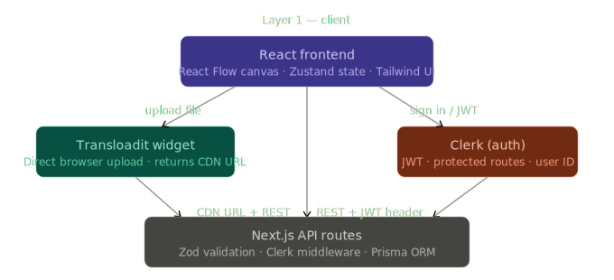

# NextFlow — LLM Workflow Builder

> A Krea.ai-inspired visual AI pipeline builder.  
> Drag typed nodes onto a canvas, wire them together, and execute entire LLM workflows — every node runs as a **Trigger.dev** background task.

**Stack:** Next.js (App Router) · React Flow · Gemini API · Trigger.dev · Clerk · Prisma / Neon · Transloadit · TypeScript

---

## Architecture Overview

NextFlow is split into three conceptual layers. The diagrams below show what lives in each layer and how data moves between them.

---

### Diagram 1 — Client Layer

> What lives in the browser and how auth fits in.

The React frontend, Clerk auth widget, and Transloadit direct-upload widget all live at or near the browser. Clerk wraps every request with a JWT, while **Transloadit bypasses the API entirely** — the browser uploads media straight to Transloadit's CDN, and only the resulting CDN URL is sent to the server.



**Key insight:** Transloadit handles heavy media uploads directly from the browser. The API never touches raw file bytes — it only receives lightweight CDN URLs.

---

### Diagram 2 — Execution & Persistence Layer

> How API routes fan out to Trigger.dev tasks and the database, and how results flow back.

When a request hits the API, it fans out in **two directions simultaneously**: left to Trigger.dev for task execution, and right to Neon PostgreSQL for persistence. The dashed webhook arrow shows the **async return path** — Trigger.dev calls back when tasks complete.



**Key insight:** The API layer is a thin dispatcher — it validates, persists, and fans out. All heavy computation happens inside Trigger.dev tasks, which report back asynchronously via webhook.

---

### Diagram 3 — Request Lifecycle ("Run Workflow" Click)

> A single end-to-end trace showing exactly what happens when a user clicks "Run workflow".

This traces the numbered sequence of a full workflow execution. The order is unambiguous: JWT check → Zod validation → DB record creation → parallel task dispatch → async webhook callbacks → UI update.



**Key insight:** The frontend performs the topological sort and determines wave grouping *before* hitting the API. The API then dispatches all tasks for the current wave in parallel. Results flow back asynchronously via webhooks, and the frontend polls for updates until all nodes complete.

---

## Tech Stack

| Layer | Technology | Purpose |
|---|---|---|
| Framework | Next.js 14+ (App Router) | SSR/SSG, API routes |
| Language | TypeScript (strict) | End-to-end type safety |
| Canvas | React Flow | Visual node graph |
| State | Zustand | Client-side workflow state |
| Validation | Zod | API + data boundary schemas |
| Styling | Tailwind CSS | Dark theme, layout |
| Auth | Clerk | Authentication, route protection |
| Database | PostgreSQL (Neon) | Workflow & history storage |
| ORM | Prisma | Type-safe DB access |
| Task Runner | Trigger.dev | Background node execution |
| File Uploads | Transloadit | Media upload + CDN |
| Media | FFmpeg (via Trigger.dev) | Crop, frame extraction |
| LLM | Google Generative AI SDK | Gemini API |
| Deployment | Vercel | Hosting |

---

## Node Types

| Node | Inputs | Output | Execution |
|---|---|---|---|
| **Text** | — | `text` | Immediate |
| **Upload Image** | — | `image URL` | Transloadit direct upload |
| **Upload Video** | — | `video URL` | Transloadit direct upload |
| **Run LLM** | `system_prompt`, `user_message`, `images` | `text` | Trigger.dev → Gemini |
| **Crop Image** | `image_url`, `x%`, `y%`, `w%`, `h%` | `image URL` | Trigger.dev → FFmpeg |
| **Extract Frame** | `video_url`, `timestamp` | `image URL` | Trigger.dev → FFmpeg |

---

## Getting Started

```bash
# Install dependencies
npm install

# Set up environment variables
cp .env.example .env.local
# Fill in: Clerk, Neon, Trigger.dev, Transloadit, Gemini keys

# Run database migrations
npx prisma migrate dev

# Start development server
npm run dev
```

---

## Environment Variables

| Variable | Source |
|---|---|
| `NEXT_PUBLIC_CLERK_PUBLISHABLE_KEY` | Clerk Dashboard |
| `CLERK_SECRET_KEY` | Clerk Dashboard |
| `DATABASE_URL` | Neon Console |
| `TRIGGER_SECRET_KEY` | Trigger.dev Dashboard |
| `TRANSLOADIT_KEY` | Transloadit Console |
| `TRANSLOADIT_SECRET` | Transloadit Console |
| `GEMINI_API_KEY` | Google AI Studio |

---

## License

Private — All rights reserved.
